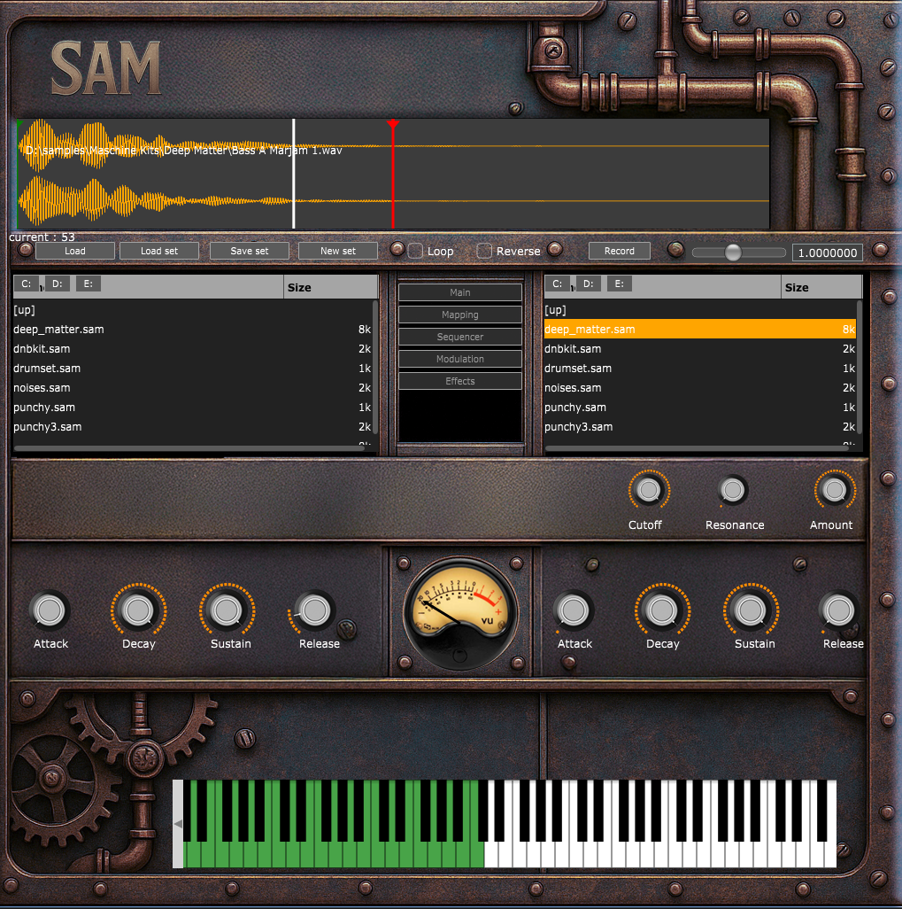
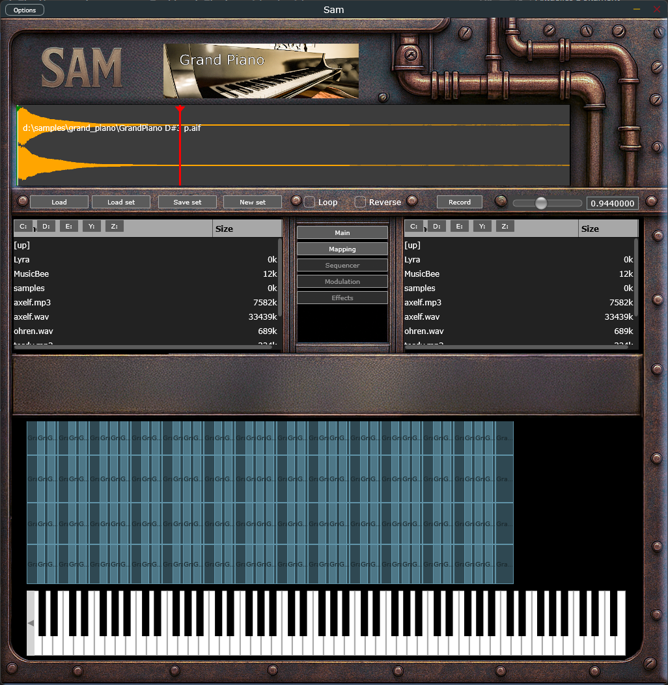

# SAM – The Audio Sampler

**SAM** is a powerful audio sampler built with **JUCE**, designed for musicians, producers, and sound designers.  
It offers an intuitive interface, deep MIDI integration, and flexible zone and effect management, making it a precise and expressive tool for working with samples.

---



Multisample Editor



---

## Features

- **Multidample Mapping and Editing**
- **Record from audio in**
- **MIDI Keyboard Integration**  
  Trigger and play samples directly with any MIDI controller.

- **Envelopes & Modulation**  
  ADSR envelopes for volume, filter, and other parameters.

- 🖥 **User-Friendly Interface**  
  - Drag & Drop sample loading  
  - Waveform display and editing
---

## Installation

### Requirements
- **JUCE Framework**  
- C++17 or newer  
- CMake or Projucer (depending on workflow)  
- Supported Platforms: Windows, macOS, Linux  

### Build
```bash
git clone https://github.com/YOUR-GITHUB/SAM.git
cd SAM

# open with Projucer or CMake and build
```

Check out the release section for a binary, currently I provide only a Windows VST3

## Important

Use SAM as an audio effect and route the MIDI Input from your DAW to the SAM Track.
